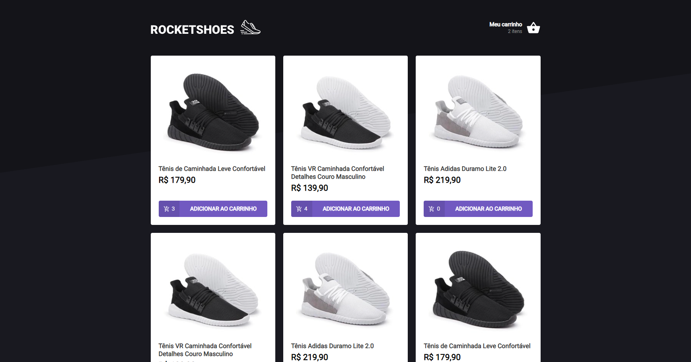
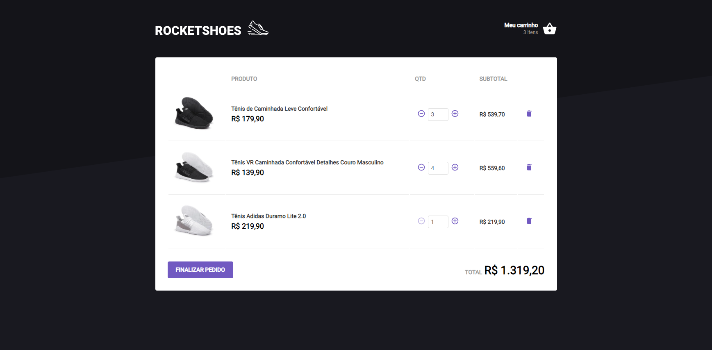

# Ignite Challenge - A shopcart with hooks and localStorage

<p align="left">
  <a href="https://www.linkedin.com/in/murilosambuite/"> 
    
  </a>
</p>

> App developed at [Rocketseat Ignite](https://www.rocketseat.com.br/ignite).

## :camera: Visual Demo

<p align="center">
   
</p>

<br />

<p align="center">
  
</p>

<p align="center">
  
</p>

<br />

---

<em>**THE CHALLENGE PROPOSAL**: I receive an application and I have to make specific changes to improve the code, these changes are correct when the tests pass. </em>

---

## :clipboard: Tests

### - hooks/useCart.tsx

- should be able to initialize cart with localStorage value
- should be able to add a new product
- should not be able add a product that does not exist
- should be able to increase a product amount when adding a product that already exists on cart
- should not be able to increase a product amount when running out of stock
- should be able to remove a product
- should not be able to remove a product that does not exist
- should be able to update a product amount
- should not be able to update a product that does not exist
- should not be able to update a product amount when running out of stock
- should not be able to update a product amount to a value smaller than 1

### - pages/Home/index.tsx

- should be able to render each product quantity added to cart
- should be able to add a product to cart

### - pages/Cart/index.tsx

- should be able to increase/decrease a product amount
- should not be able to decrease a product amount when value is 1
- should be able to remove a product

### - components/Header/index.tsx

- should be able to render the amount of products added to cart

<br />

---

## :hammer: Tools/Technologies

- **React** — A library to build user interfaces
- **Axios** — API requests
- **JSON server** — API mocking library
- **Polished** — A toolset for writing styles in JS
- **Styled-components** — CSS-in-JS library
- **React-toastify** — A library to display toast notifications

<br />

---

## :computer: Installation

### Step by step to run the application on your machine:

Clone this repository
(You will need git installed) :

```
  git clone https://github.com/sambuite/desafio-hook-carrinho-de-compras.git

  cd desafio-hook-carrinho-de-compras
```

Run the following scripts
(You will need npm or yarn installed) :

```
  // Install the dependencies
  npm install

  // Start the application
  npm start
```

or if you use yarn

```
  // Install the dependencies
  yarn

  // Start the application
  yarn start
```
